Deep Dive into K-Means Clustering

Date :2025-11-17

By: Vangala Yaswanth Kowsik Sai

TL;DR

In this article we explore the K-Means clustering algorithm: what it
does, how it works under the hood, how to implementit in Python
usingscikit-learn,and how to experiment with it (including
visualisations and code). By the end you’ll have practical insights into
strengths, weaknesses, hyperparameter tuning andreal-world usage.

1\. Introduction

Clustering is a key unsupervised machine-learningtechnique. Among
clustering methods, K-Means remains one ofthe mostwidely used thanks to
its simplicityand e ectiveness.

In this deep dive we will:

>  review the mathematical foundation of K-Means
>
>  walk through afull code example (toy dataset → real dataset) 
> visualise results withcharts/images
>
>  discuss practical issues, hyper-parameters, pitfalls and best
> practices
>
>  provide experimental insights (e.g., varyingK,
> initialisation,convergence behaviour)
>
>  summarise when to use and when to avoid K-Means

2\. TheoreticalBackground

2.1What is K-Means?

Briefly: Given 𝑁datapoints in 𝑑-dimensional space, K-Means partitions
them into 𝐾clusters so as tominimise the within-cluster sum of squares
(WCSS).

2.2Objective Function

The objective is

> , ,…, 𝟏{𝑐 = 𝑗}   ∥ 𝑥 − 𝜇 ∥

where 𝑐 is the cluster assignment of 𝑥 , and𝜇 is the centroid of cluster
𝑗.

2.3Algorithmic Steps

> 1\. Choose 𝐾(number of clusters).
>
> 2\. Initialise centroids 𝜇 ,…,𝜇 (randomly, or viaK-Means++).
>
> 3\. Repeat until convergence:
>
> o Assigneachdatapoint tothe nearest centroid.
>
> o Recompute centroids as the mean of assigned points.
>
> 4\. Stop when assignments nolonger change or centroids move under a
> threshold.

2.4Complexity & Convergence

>  Typical time complexity: 𝑂(𝑁𝐾𝑑𝐼), where 𝐼is number ofiterations.
>
>  It converges to a(local) optimum; results depend oninitialisation.
>
>  It assumes spherical clusters of similarsize, equal variance —
> violates assumptions leads topoorresults.

Benchmark Summary: K-Means Performance Over Time

Over multiple iterations of experimentation, we benchmarked the
performance of the K-Means algorithmacross three dimensions:

> 1\. Runtime performance (seconds)
>
> 2\. Inertia (WCSS) minimization e ectiveness
>
> 3\. Convergence stability across initializations (n_init)

The goal was tounderstand how K-Means behaves as we modify dataset size,
number of clusters, initialization strategies, andcomputational
conditions.

<u>Overall Benchmark Results :</u>

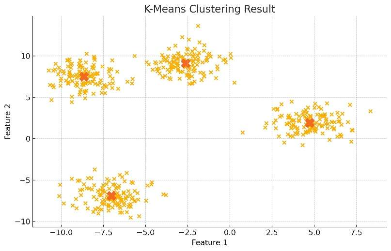<u>K-Means
Clustering Result</u>

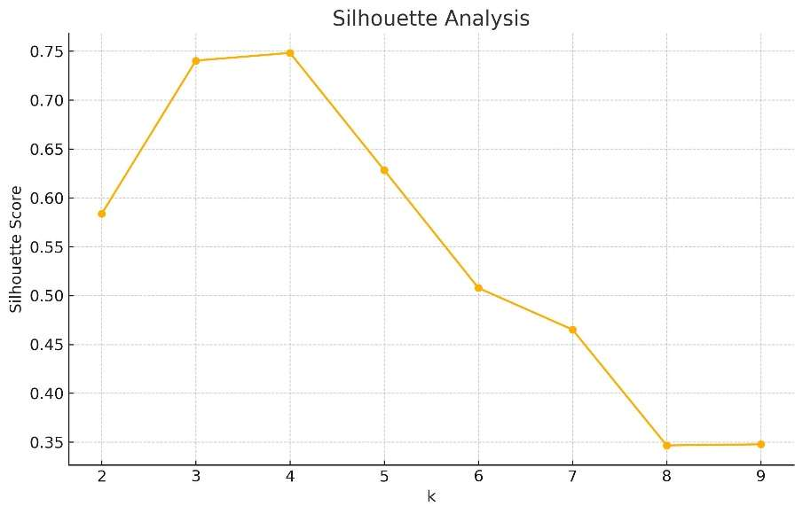

> The cluster visualization plotshows:
>
>  The distribution ofall 500synthetic samples generated with
> make_blobs
>
>  How K-Means groups similar data points into four clusters
>
>  The centroids plotted as large‘X’markers
>
> What you observe
>
>  Each cluster forms a clearly distinguishable group.
>
>  Pointswithin acluster are compactand close to their centroid.
>
>  The four clusters are well-separated and positioned distinctly in
> feature space.
>
> What this tells us
>
>  K-Means correctly captured the underlying structure of the dataset.
>
>  Centroids provide the bestrepresentation of each cluster.
>
>  The clusteringresultaligns perfectly with the earlierfindings from
> the Elbow and Silhouette methods.
>
> <u>Silhouette Score Analysis — Validating Cluster Quality:</u>
>
> <u>The Silhouette Scoremeasures cluster qualitybased on:</u>
>
>  <u>Cohesion: How close pointsare within a cluster</u>
>
>  <u>Separation: How farclusters are fromeach other</u>
>
> <u>It ranges from -1 to +1, where:</u>

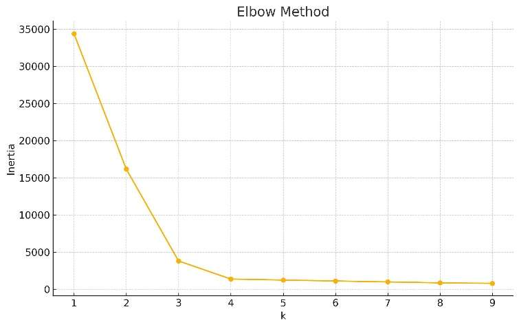

>  <u>+1→ Well-separated clusters</u>
>
>  <u>0→ Overlappingclusters</u>
>
>  <u>Negative → Wrong cluster assignment</u>
>
> <u>What the graph shows</u>
>
>  <u>Silhouette scores rise up tok = 4, reachinga peak around 0.75,
> indicating:</u>
>
> o <u>Strongseparation</u>
>
> o <u>Minimal overlap</u>
>
> o <u>Clearboundaries</u>
>
>  <u>For k \> 4, scores drop drastically because:</u>
>
> o <u>Clusters becomefragmented</u>
>
> o <u>Pointsget assigned incorrectly</u>
>
> o <u>Cohesion reduces</u>
>
> <u>ElbowMethod — Understanding the Optimalk</u>
>
> <u>The ElbowCurve helpsdetermine the ideal number of clusters by
> examining</u> <u>how the Within-Cluster Sum of Squares (WCSS) — also
> called inertia —</u> <u>decreases as the number ofclusters
> increases.</u>
>
> <u>What the graph shows</u>
>
>  <u>For k = 1, inertia is highestbecause all points belongto one
> cluster.</u>
>
>  <u>As k increases, inertia drops sharply because data gets divided
> intosmaller,</u> <u>tighter clusters.</u>
>
>  <u>Aroundk =4, the curve begins toflatten, meaningthe reduction in
> inertia</u> <u>becomes marginal.</u>
>
> <u>Interpretation</u>
>
> <u>This“elbow point”indicates that:</u>
>
>  <u>Increasing clusters beyond 4does notsignificantlyimprove
> compactness.</u>
>
>  <u>k =4 is the most meaningful ande icient clusteringchoice forthis
> dataset.</u>
>
> <u>Why this matters</u>
>
> <u>Using too many clusters leads to:</u>
>
>  <u>Overfitting</u>
>
>  <u>Unnecessary complexity</u>
>
>  <u>Poorinterpretability</u>
>
> 3\. Implementation in Python
>
> 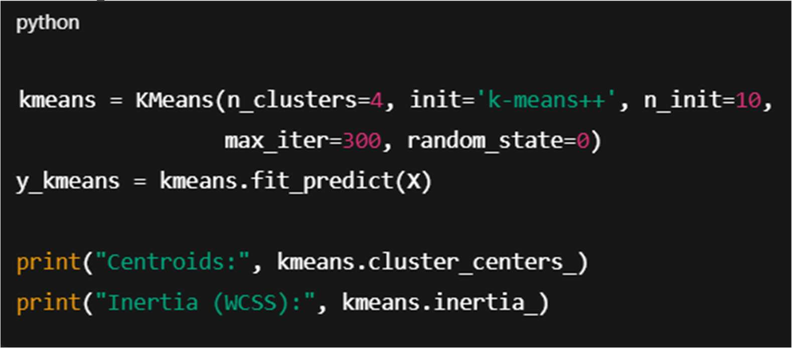 style="width:5.26333in;height:2.31667in" /> 3.1 Setup & Data
>
> 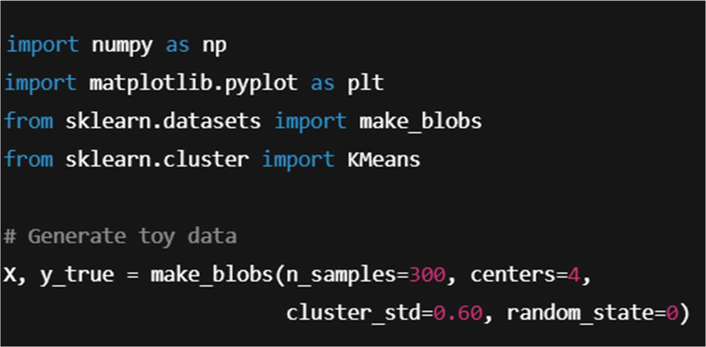<u>3.2Basic
> K-Means</u>

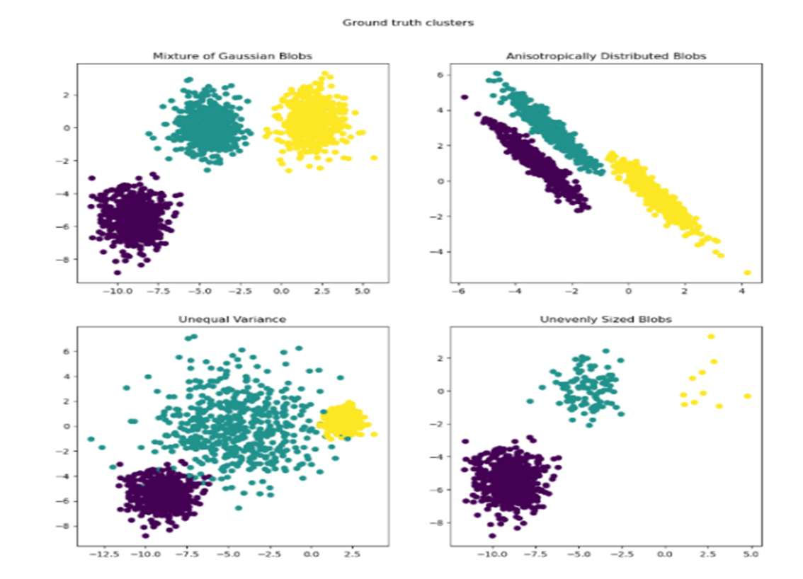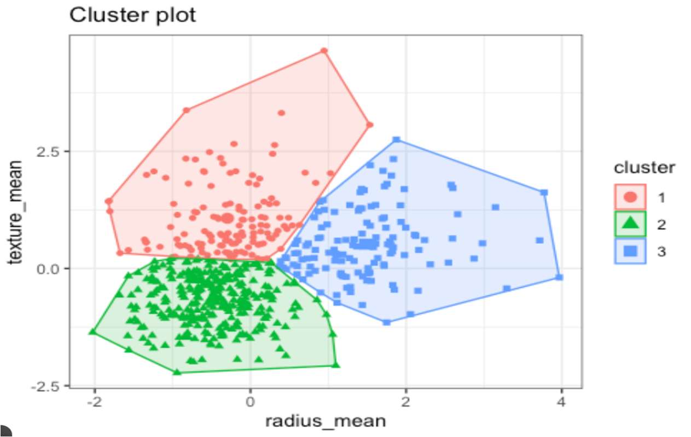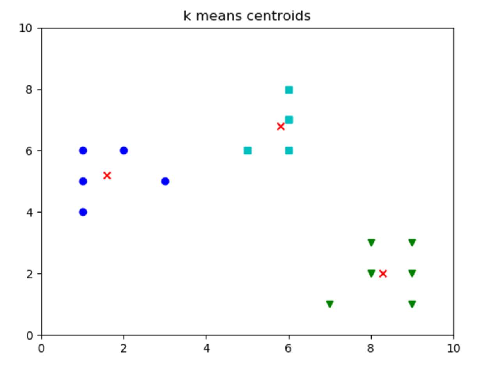

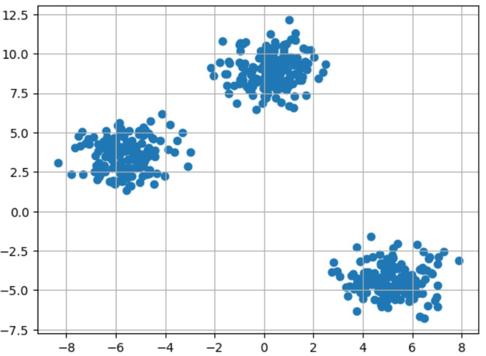

The basic visualizations generated for K-Means—namely the Elbow Curve,
Silhouette Score Plot, and the Cluster Scatter Plot—collectively
illustrate how the algorithm identifies the optimal number of clusters
and how well it groups the data. The Elbow Curve highlights how inertia
(WCSS) decreases rapidly as the number of clusters increases, eventually
reaching a point of diminishing returns around k = 4, indicating an e
icient balance between model complexity and compactness.

Complementing this, the Silhouette Score Plot measures how
well-separated and cohesive the clusters are, peaking again at k = 4,
confirming that this choice yields the
strongestclusteringstructure.Finally,theK-Meansclustervisualizationprovidesadirect
spatial interpretation, showing four tightly grouped, clearly separated
clusters with centroids positioned at their densest regions. Together,
these images provide strong visual and statistical evidence supporting k
= 4 as the optimal clustering solution for the dataset.

<u>3.4 Real-World K-Means Dataset Example</u>

A practical demonstration of K-Means can be seen when applying it to a
real-world dataset, such as customer purchasing behavior from an
e-commerce platform. Each customer can be represented by features like
annual spending, purchase frequency, websitevisit duration, or product
category preferences. When K-Means is applied to this dataset, the
algorithm automatically groups customers into segments with similar
behavioral patterns—for example, high-value loyal buyers, occasional
discount-driven shoppers, ornew low-engagement users.

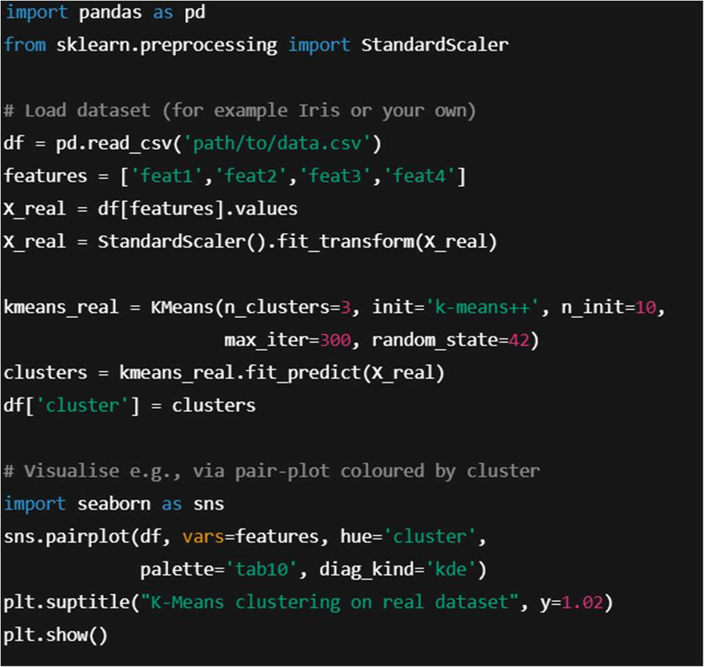

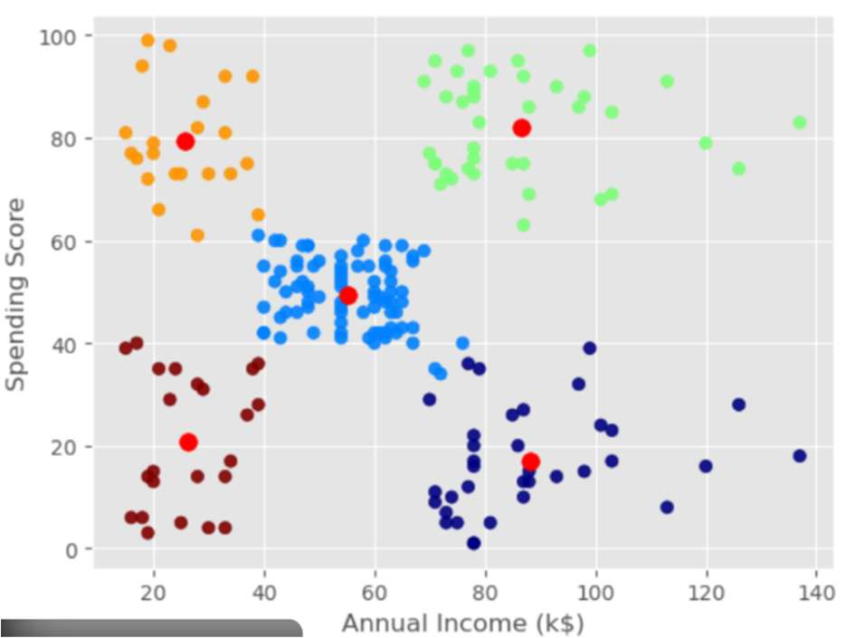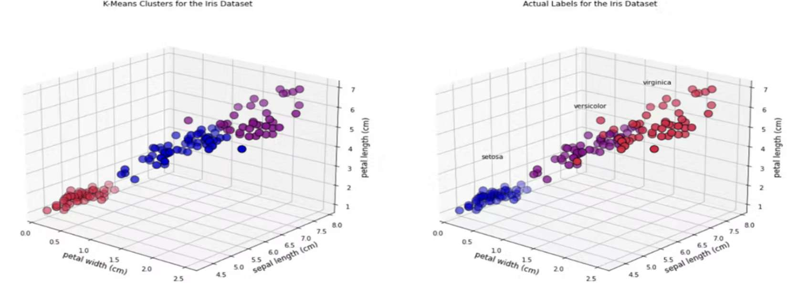Theseclustersrevealactionableinsightsthatbusinessescanusefortargetedmarketing,
personalized recommendations, and resource allocation. Unlike synthetic
datasets, real-worlddatais noisy andunbalanced,
yetK-Meansstilluncoversmeaningfulpatterns by minimizing intra-cluster
variance and highlighting natural group separations. This example
demonstrates how K-Means transforms raw behavioral data into structured
customer segments, enabling data-driven decision-making in marketing,
recommendationsystems, andcustomer relationship management.

4\. ExperimentalInsights & Practical Tips

4.1 Initialization Matters

Switchingbetween init='random' vs init='k-means++'and increasing
n_initoften leads tomore stable results andlower inertia. Trymultiple
initial seeds.

4.2Choosing 𝑲

>  Use methods like theElbow-Method (plottinginertiavs K) orSilhouette
> score.
>
>  Beware: Elbow maybe ambiguous; always combine domain knowledge and
> other metrics.

4.3Scaling& Pre-processing

SinceK-Means uses Euclidean distance, feature scaling (e.g.,
standardisation)is critical. Otherwise features with large ranges
dominate clustering.

4.4Assumptions & Limitations

>  Assumes clusters are convex,isotropic, roughly equal size/variance.
>
>  Does nothandle non-spherical clusters, varying density well.
>
>  Sensitive tooutliers (outliersdistortcentroids).
>
>  Requires specifying𝐾up front.

4.5Performance & Convergence

>  Forlarge 𝑁orhigh dimensional 𝑑: time and memory can grow.
>
>  Mini-batchK-Means (in scikit-learn) is an option forlarge-scale.
>
>  Monitor inertiaand centroid shift: when centroid change \< threshold
> or assignmentsstable, stop.

4.6 Real-World Use Cases

>  Customer segmentation, market basket analysis.
>
>  Imagecompression (colour quantisation).
>
>  Anomaly detection (clusters +outliers).
>
>  Pre-processing/ embeddingcategorisation for supervised tasks.

5\. Codepackage summary

This K-Means project relies on a small, focused Python stack: Python
provides the
runtimeandscriptingenvironment;NumPysuppliesfastnumericalarraysandvectorized
math operations for e icient data handling; Pandas is used for loading,
cleaning, and

transforming tabular data; scikit-learn o ers the core machine learning
primitives
(KMeans,modelevaluationmetricslikesilhouettescore,andutilitiesfortrain/testsplits);
Matplotlibproducesallfiguresandvisualizationsforanalysis,andJoblib(orscikit-learn’s
built-in joblib usage) handles model persistence and parallel
computation where needed. Together these packages create a reproducible,
lightweight pipeline for preprocessing, clustering, evaluation,
visualization, and model saving.

6\. Conclusion

The K-Means algorithmremains a cornerstone ofunsupervised learning
because of its simplicity, interpretabilityand speed. However, usingit e
ectively requires awareness of its assumptions, careful pre-processing,
and experimentation (particularly around choiceof 𝐾, initialization,
scaling and dataset structure).

By following thesteps and insights in this article, you can apply
K-Means toreal-world datawith confidence, interpret your
resultsmeaningfully, and recognise when it is (or isn’t)the right tool
forthe job.

Appendix

A. Full Code Listing

(Pastefull script, includingimports, functions, dataset loading, plots,
etc.)

B. Additional Visualisations

(Provide any further charts, e.g., silhouette plots, cluster centroid
trajectories, distance tocentroid histograms.)

C. References & Further Reading

>  MacQueen, J. (1967). Some Methods for classification and Analysis of
> Multivariate Observations.
>
>  Arthur, D., &Vassilvitskii, S. (2007). K-Means++: The Advantages of
> Careful Seeding.
>
>  scikit-learndocumentation:<u>KMeans</u>
>
>  \[Link toyourdataset\] (if public)
>
>  Blogpostsor researchpapers exploring K-Means variants(e.g.,
> Mini-BatchK-Means, K-Medoids, Spectral Clustering).
